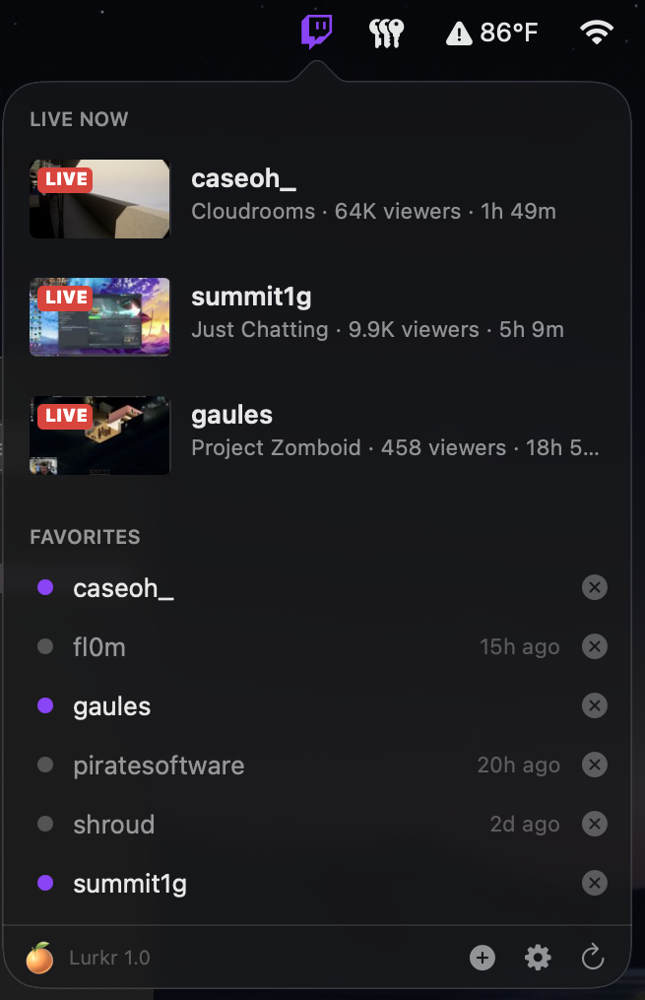
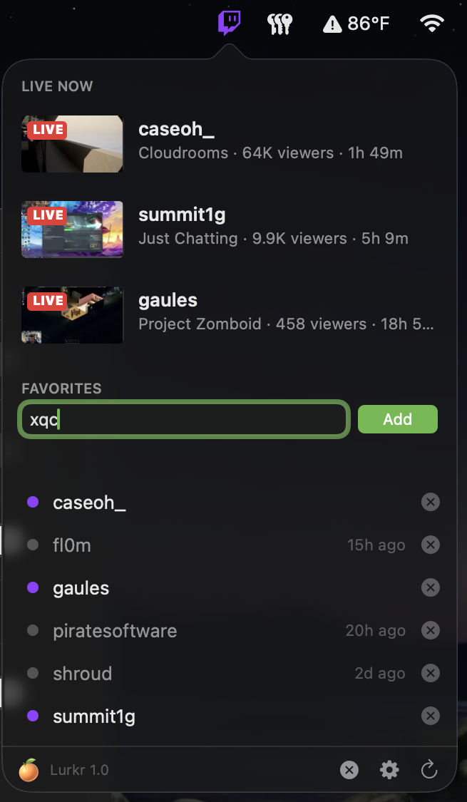
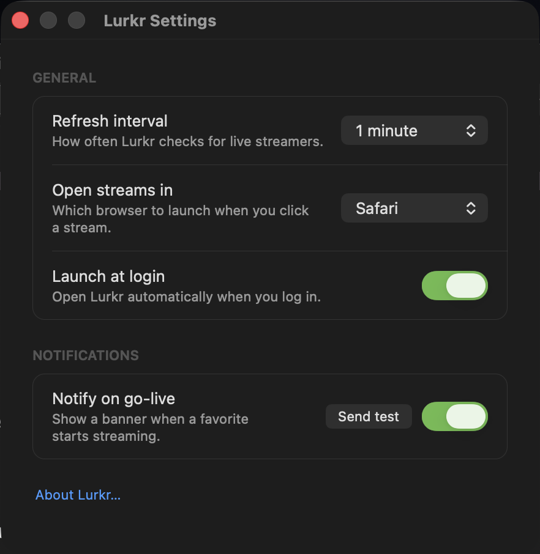
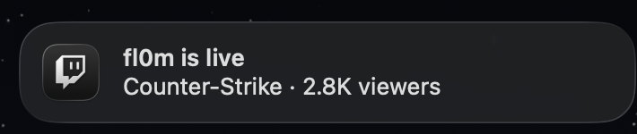

<div align="center">


# Lurkr

**A tiny macOS menu bar app that tells you when your favorite Twitch streamers go live.**

No login. No API keys. No Electron. One small Swift binary that sits in your menu bar and turns purple when someone you care about starts streaming.

[](https://www.apple.com/macos/)
[](https://swift.org)
[](Package.swift)
[](LICENSE)



</div>

---

## Why

Twitch's own notifications mean an account, a browser tab, and an algorithm deciding what you should care about. Lurkr just watches a list of names you typed in yourself, and gets out of the way.

The menu bar icon is monochrome when nobody's on, purple when someone is. That's the whole product.

## Features

|                           |                                                                                            |
| ------------------------- | ------------------------------------------------------------------------------------------ |
| 🟣 **At-a-glance status** | Menu bar glyph turns Twitch-purple the moment any favorite goes live                        |
| 📺 **Live cards**         | Stream thumbnail, category, viewer count and uptime — sorted by viewers                     |
| 🔔 **Go-live banners**    | Native notifications when a favorite starts; click one to open the stream                   |
| 🕓 **Last seen live**     | Offline favorites show when they last streamed, backfilled from their most recent VOD       |
| 🌐 **Your browser**       | Opens streams in Safari, Chrome, or Firefox — your pick, not the system default             |
| 🔒 **No account needed**  | No Twitch login, no OAuth, no API keys, no tracking — sandboxed, network-client only        |
| 🪶 **Tiny**               | Pure AppKit, zero third-party dependencies, ~2k lines of Swift                              |

## Install

### Download

Grab the latest zip from [Releases](https://github.com/scottfoster/lurkr/releases/latest), unzip it, and drag `Lurkr.app` to `/Applications`.

Signed with a Developer ID certificate and notarized by Apple, so it opens with no security warnings.

Prebuilt zips are **Apple Silicon only**. On an Intel Mac, build from source.

### Build from source

Takes about 30 seconds.

```bash
git clone https://github.com/scottfoster/lurkr.git
cd lurkr
./make-app.sh --install
```

That builds a release binary, renders the app icon, assembles `Lurkr.app`, ad-hoc code-signs it, moves it to `/Applications`, and launches it. Look for the Twitch glyph in your menu bar.

To build the bundle without installing it, drop the flag:

```bash
./make-app.sh          # produces ./Lurkr.app
```

**Requirements:** macOS 13 (Ventura) or later, and the Xcode command line tools (`xcode-select --install`).

## Usage

Click the menu bar icon to open the popover.

<div align="center">

</div>

- **Add a favorite** — hit <kbd>+</kbd> in the footer, type a Twitch username, press <kbd>Return</kbd>. Lurkr checks the name actually exists before adding it.
- **Watch a stream** — click any live card, or any live name in the favorites list.
- **Remove a favorite** — click the ✕ next to a name and confirm.
- **Refresh now** — the ↻ button. Lurkr also polls on its own schedule.

A purple dot means live; grey means offline, with the last time they streamed on the right.

## Settings

<div align="center">

</div>

| Setting              | Options                                | Default  |
| -------------------- | -------------------------------------- | -------- |
| **Refresh interval** | 30 seconds, 1, 2, or 5 minutes         | 1 minute |
| **Open streams in**  | Safari, Chrome, Firefox                | Safari   |
| **Launch at login**  | On / off (requires install to `/Applications`) | Off      |
| **Notify on go-live**| On / off, with a **Send test** button  | On       |

## Notifications

When a favorite starts streaming, you get a native banner. Clicking it opens the stream in your chosen browser.

<div align="center">

</div>

Lurkr deliberately stays quiet on the first refresh after launch — otherwise every already-live streamer would fire a banner the moment you log in.

## How it works

Lurkr talks to [**decapi.me**](https://decapi.me), a free public read-only proxy in front of Twitch's API. That's the trick that lets it skip OAuth entirely — there's no client ID or secret anywhere in this repo, and nothing to register.

For each favorite, per refresh:

| Endpoint                                | Used for                                     |
| --------------------------------------- | -------------------------------------------- |
| `decapi.me/twitch/uptime/<login>`       | Live check + how long they've been streaming |
| `decapi.me/twitch/title/<login>`        | Stream title                                 |
| `decapi.me/twitch/game/<login>`         | Category                                     |
| `decapi.me/twitch/viewercount/<login>`  | Viewer count                                 |
| `decapi.me/twitch/id/<login>`           | Validating a username when you add it        |
| `decapi.me/twitch/videos/<login>`       | Finding the latest VOD for "last seen live"  |

Thumbnails come straight from Twitch's public preview CDN (`static-cdn.jtvnw.net`).

A couple of details worth knowing:

- **Last-seen backfill.** For an offline favorite Lurkr has never observed going live, it grabs their most recent VOD URL and reads the `og:video:release_date` meta tag off that page — so "2d ago" is right even on a fresh install.
- **Connection banner.** If more than half of a refresh's requests fail, the popover shows an orange "Can't reach decapi.me" warning rather than silently claiming everyone is offline.
- **Be polite.** Every favorite costs a handful of requests per refresh. decapi is someone else's free service — a long list on a 30-second interval is not neighborly.

## Configuration

Settings live in a small JSON file you can edit by hand (quit Lurkr first — it writes the file on every refresh):

```
~/Library/Containers/com.singlepeel.lurkr/Data/.config/lurkr/config.json
```

The app is sandboxed, so that container path *is* its home directory. When you run it unsandboxed during development (`swift run`), the same file lands at `~/.config/lurkr/config.json` instead.

```json
{
  "favorites": ["shroud", "fl0m"],
  "lastSeenLive": { "shroud": "2026-07-24T17:44:21Z" },
  "pollIntervalSeconds": 60,
  "notificationsEnabled": true,
  "browser": "safari"
}
```

Unknown or missing keys fall back to defaults, so configs written by older versions keep working.

## Development

```bash
swift build            # debug build
swift run              # run unsandboxed, straight from the terminal
./make-app.sh          # release build + .app bundle
```

Running via `swift run` is the fast loop, with two caveats: **Launch at login** is disabled outside a real `.app` bundle, and the unsandboxed process uses `~/.config/lurkr/` for its config.

### Project layout

```
Sources/Lurkr/
├── App.swift                 NSApplication entry point (.accessory — no Dock icon)
├── AppDelegate.swift         Wires up the status bar controller and notifications
├── StatusBarController.swift Polling loop, go-live diffing, menu bar item, window management
├── MainPopover.swift         The popover UI: live cards, favorites list, add/remove, footer
├── TwitchAPI.swift           decapi.me client (actor), VOD date scraping, response sanitizing
├── Config.swift              JSON config load/save with lenient decoding
├── SettingsWindow.swift      Settings window
├── AboutWindow.swift         About window
├── Notifications.swift       UNUserNotificationCenter wrapper
└── Icon.swift                Menu bar glyph, drawn in code as a Bézier path
Tools/render_icons.swift      Renders the .iconset used to build AppIcon.icns
```

There are no image assets in this repo — both the menu bar glyph and the app icon are drawn with `NSBezierPath` at build time.

### Signing

`make-app.sh` ad-hoc signs by default, which is fine for local use. For a Developer ID build:

```bash
SIGNING_IDENTITY="Developer ID Application: Your Name (TEAMID)" ./make-app.sh
```

To cut a release build — signed, notarized, stapled, and zipped for distribution:

```bash
xcrun notarytool store-credentials lurkr-notary \
    --apple-id you@example.com --team-id TEAMID    # one time only

SIGNING_IDENTITY="Developer ID Application: Your Name (TEAMID)" ./make-app.sh --dist
```

That produces `Lurkr-<version>-arm64.zip` with the notarization ticket stapled into the bundle, so Gatekeeper clears it even on a machine that's offline. Bump `VERSION` in `make-app.sh` first — it feeds both the bundle's `CFBundleShortVersionString` and the zip filename.

Entitlements are in [`Lurkr.entitlements`](Lurkr.entitlements): App Sandbox plus outgoing network connections, nothing else.

## Privacy

Lurkr has no analytics, no telemetry, and no server of its own. Your favorites list never leaves your Mac except as streamer names in requests to decapi.me and Twitch's thumbnail CDN. A [privacy manifest](PrivacyInfo.xcprivacy) is included, declaring no tracking and no collected data.

## Contributing

Issues and pull requests are welcome. This is a small, deliberately simple app — the bar for new features is "does this earn its pixels in a 320-point-wide popover?"

## Credits

- [decapi.me](https://decapi.me) by [Decicus](https://github.com/Decicus) — the public Twitch proxy doing the heavy lifting.

## License

[MIT](LICENSE) © 2026 Singlepeel

> Lurkr is an independent project and is not affiliated with, endorsed by, or sponsored by Twitch Interactive, Inc. The Twitch name and glitch mark are trademarks of Twitch Interactive, Inc.
